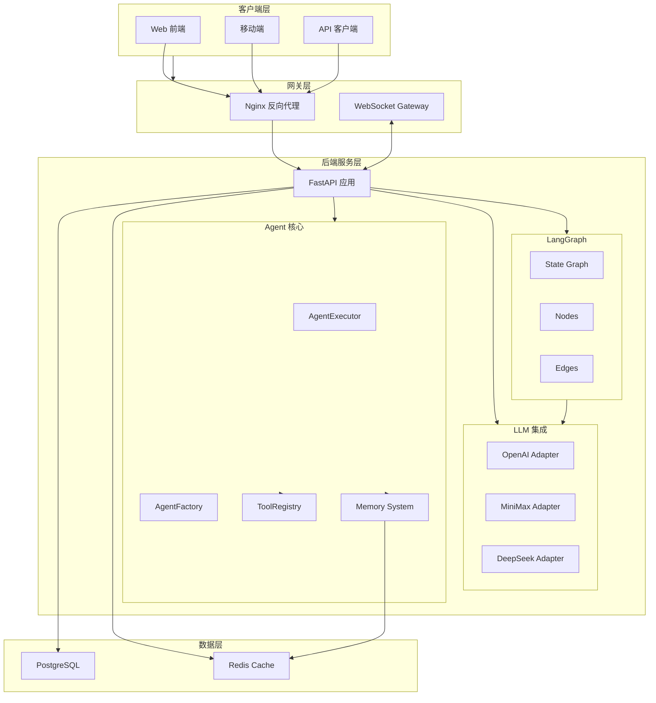
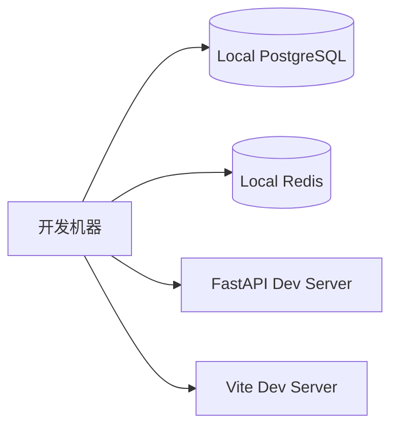
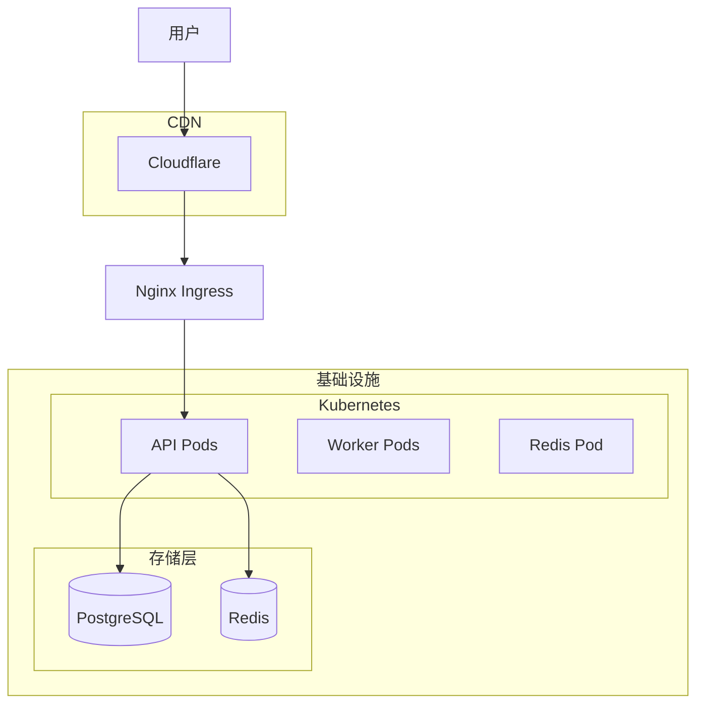

# 系统架构概述

## 整体架构图



## 技术栈说明

### 前端技术栈

| 技术 | 版本 | 用途 |
|------|------|------|
| React | 18.x | UI 框架 |
| TypeScript | 5.x | 类型安全 |
| Ant Design | 5.x | UI 组件库 |
| Zustand | 4.x | 状态管理 |
| React Query | 4.x | 数据获取 |
| TailwindCSS | 3.x | CSS 框架 |

### 后端技术栈

| 技术 | 版本 | 用途 |
|------|------|------|
| Python | 3.11+ | 运行环境 |
| FastAPI | 0.109.0 | Web 框架 |
| Pydantic | 2.5.3 | 数据验证 |
| LangGraph | 0.0.20 | Agent 编排 |
| SQLAlchemy | 2.0.25 | ORM |
| Uvicorn | 0.27.0 | ASGI 服务器 |

### 数据存储

| 技术 | 用途 |
|------|------|
| PostgreSQL | 主数据库 |
| Redis | 缓存、会话、消息队列 |

## 数据库设计

### 核心表结构

```sql
-- Agent 表
CREATE TABLE agents (
    id UUID PRIMARY KEY,
    name VARCHAR(100) NOT NULL,
    role VARCHAR(50) NOT NULL,
    description TEXT,
    instructions TEXT NOT NULL,
    config JSONB DEFAULT '{}',
    status VARCHAR(20) DEFAULT 'idle',
    created_at TIMESTAMP DEFAULT NOW(),
    updated_at TIMESTAMP DEFAULT NOW()
);

-- Task 表
CREATE TABLE tasks (
    id UUID PRIMARY KEY,
    agent_id UUID REFERENCES agents(id),
    type VARCHAR(20) NOT NULL,
    status VARCHAR(20) DEFAULT 'pending',
    input_data JSONB DEFAULT '{}',
    output_data JSONB,
    error TEXT,
    created_at TIMESTAMP DEFAULT NOW(),
    completed_at TIMESTAMP
);

-- Memory 表
CREATE TABLE memories (
    id UUID PRIMARY KEY,
    agent_id UUID REFERENCES agents(id),
    memory_type VARCHAR(20), -- 'short_term' / 'long_term'
    role VARCHAR(20),
    content TEXT,
    metadata JSONB DEFAULT '{}',
    created_at TIMESTAMP DEFAULT NOW()
);

-- Session 表
CREATE TABLE sessions (
    id UUID PRIMARY KEY,
    user_id VARCHAR(100),
    agent_id UUID REFERENCES agents(id),
    context JSONB DEFAULT '{}',
    created_at TIMESTAMP DEFAULT NOW(),
    updated_at TIMESTAMP DEFAULT NOW()
);
```

## 部署架构

### 开发环境



### 生产环境



### 容器化部署

```yaml
# docker-compose.yml 结构
services:
  api:
    build: ./backend
    ports:
      - "8000:8000"
    environment:
      - DATABASE_URL=postgresql+asyncpg://postgres:password@db:5432/ai_agent
      - REDIS_URL=redis://redis:6379/0
    depends_on:
      - db
      - redis

  worker:
    build: ./backend
    command: python -m agent.runner
    environment:
      - DATABASE_URL=postgresql+asyncpg://postgres:password@db:5432/ai_agent
      - REDIS_URL=redis://redis:6379/0
    depends_on:
      - db
      - redis

  db:
    image: postgres:15
    volumes:
      - pgdata:/var/lib/postgresql/data

  redis:
    image: redis:7-alpine
    volumes:
      - redisdata:/data

volumes:
  pgdata:
  redisdata:
```

## 系统特性

### 高可用设计

1. **无状态 API**：API 服务无状态，支持水平扩展
2. **连接池**：数据库和 Redis 连接池复用
3. **异步架构**：全面使用 async/await，提升并发能力

### 安全设计

1. **JWT 认证**：API 请求身份验证
2. **CORS 控制**：跨域请求管理
3. **输入验证**：Pydantic 模型自动验证
4. **SQL 注入防护**：ORM 参数化查询

### 性能优化

1. **Redis 缓存**：热点数据缓存
2. **连接复用**：HTTP/1.1 Keep-Alive
3. **批量处理**：任务批量提交
4. **流式响应**：LLM 流式输出支持
