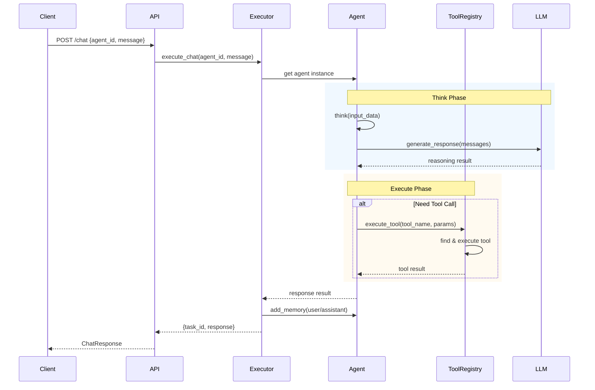
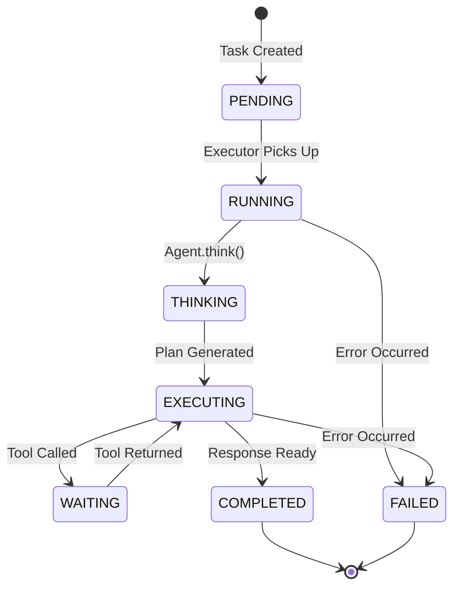
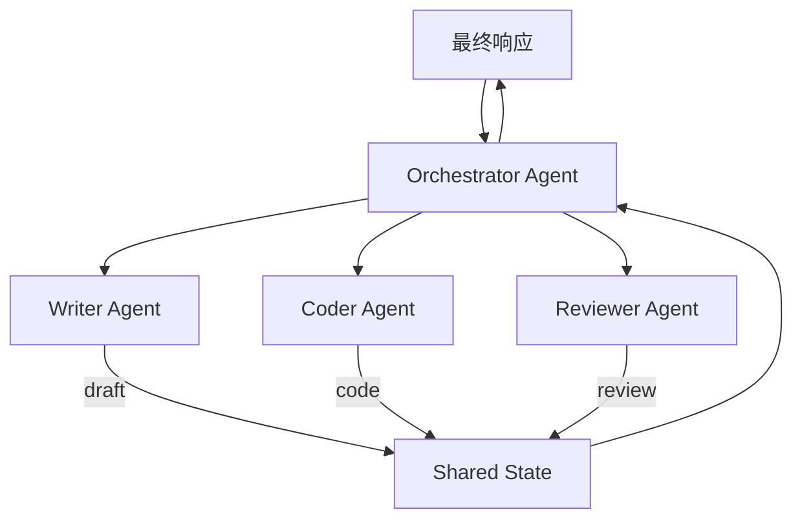
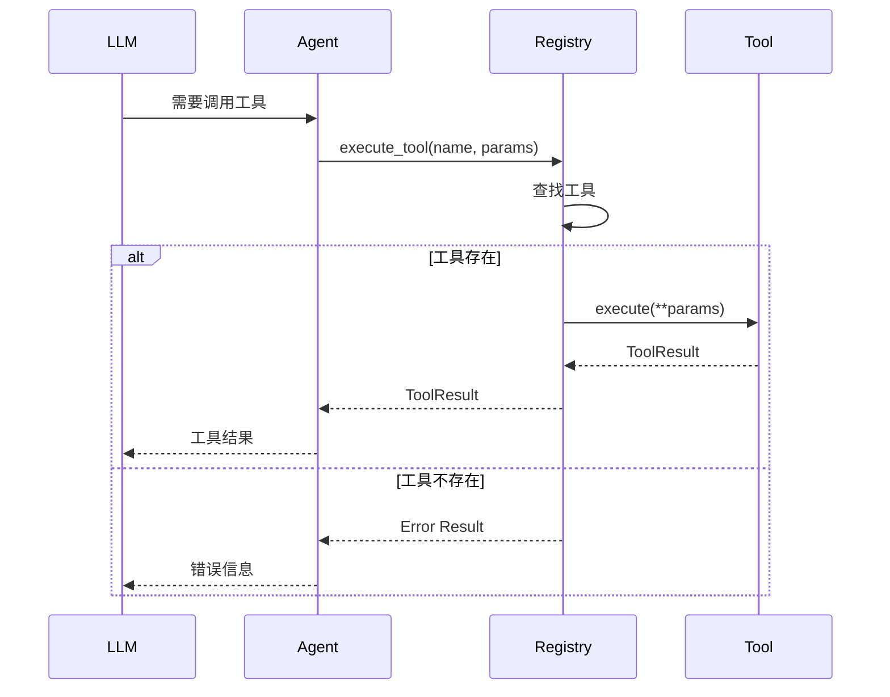

# Agent 核心模块设计

## 核心接口设计

### BaseAgent 抽象基类

```python
from abc import ABC, abstractmethod
from typing import Dict, Any, List, Optional
from datetime import datetime

class BaseAgent(ABC):
    """Agent 抽象基类 - 所有 Agent 的父类"""
    
    def __init__(
        self,
        id: str,
        name: str,
        role: str,
        instructions: str,
        config: Dict[str, Any] = None
    ):
        self.id = id
        self.name = name
        self.role = role
        self.instructions = instructions
        self.config = config or {}
        self.memory: List[Dict[str, Any]] = []
        self.status = "idle"
    
    @abstractmethod
    async def think(self, input_data: Dict[str, Any]) -> Dict[str, Any]:
        """思考阶段 - 分析输入，理解任务"""
        pass
    
    @abstractmethod
    async def execute(self, input_data: Dict[str, Any]) -> Dict[str, Any]:
        """执行阶段 - 调用工具，完成任务"""
        pass
    
    def add_memory(self, role: str, content: str, metadata: Dict[str, Any] = None):
        """添加对话记忆"""
        self.memory.append({
            "role": role,
            "content": content,
            "metadata": metadata or {},
            "timestamp": datetime.now().isoformat(),
        })
    
    def get_memory(self, limit: int = 10) -> List[Dict[str, Any]]:
        """获取最近记忆"""
        return self.memory[-limit:]
    
    def clear_memory(self):
        """清空记忆"""
        self.memory = []
```

### Agent 类型定义

```python
from enum import Enum
from pydantic import BaseModel, Field
from typing import Dict, Any, Optional
from datetime import datetime

class AgentStatus(str, Enum):
    """Agent 运行状态"""
    IDLE = "idle"       # 空闲
    THINKING = "thinking"  # 思考中
    EXECUTING = "executing"  # 执行中
    WAITING = "waiting"  # 等待工具返回
    ERROR = "error"      # 错误

class AgentType(str, Enum):
    """Agent 类型"""
    CHAT = "chat"           # 对话型
    TASK = "task"           # 任务型
    WORKFLOW = "workflow"   # 工作流型

class AgentConfig(BaseModel):
    """Agent 配置"""
    temperature: float = 0.7
    max_tokens: int = 2048
    top_p: float = 1.0
    tools: List[str] = Field(default_factory=list)
    memory_limit: int = 100
```

## Agent 执行流程

### 单 Agent 执行流程



### 任务状态流转



## 多 Agent 协作流程

### 协作模式



### 消息传递机制

```python
class AgentMessage:
    """Agent 间消息"""
    def __init__(
        self,
        from_agent: str,
        to_agent: str,
        content: Any,
        msg_type: str = "request",
        correlation_id: str = None
    ):
        self.from_agent = from_agent
        self.to_agent = to_agent
        self.content = content
        self.msg_type = msg_type  # request/response/broadcast
        self.correlation_id = correlation_id
        self.timestamp = datetime.now()

class MessageBus:
    """消息总线 - Agent 间通信"""
    def __init__(self):
        self.subscribers: Dict[str, List[Callable]] = {}
        self.message_queue: asyncio.Queue = asyncio.Queue()
    
    async def publish(self, message: AgentMessage):
        """发布消息"""
        await self.message_queue.put(message)
    
    async def subscribe(self, agent_id: str, callback: Callable):
        """订阅消息"""
        if agent_id not in self.subscribers:
            self.subscribers[agent_id] = []
        self.subscribers[agent_id].append(callback)
    
    async def dispatch(self):
        """消息分发"""
        while True:
            message = await self.message_queue.get()
            for callback in self.subscribers.get(message.to_agent, []):
                await callback(message)
```

### LangGraph 协作编排

```python
from langgraph.graph import StateGraph, END
from typing import TypedDict

class MultiAgentState(TypedDict):
    """多 Agent 共享状态"""
    messages: List[Dict]
    current_agent: str
    task_result: Dict[str, Any]
    draft_content: str = ""
    review_feedback: str = ""

def create_multi_agent_graph():
    """创建多 Agent 协作图"""
    graph = StateGraph(MultiAgentState)
    
    # 添加节点
    graph.add_node("orchestrator", orchestrator_node)
    graph.add_node("writer", writer_node)
    graph.add_node("coder", coder_node)
    graph.add_node("reviewer", reviewer_node)
    
    # 定义边
    graph.add_edge("orchestrator", "writer", condition=needs_write)
    graph.add_edge("orchestrator", "coder", condition=needs_code)
    graph.add_edge("writer", "reviewer")
    graph.add_edge("reviewer", END, condition=is_approved)
    graph.add_edge("reviewer", "writer", condition=needs_revision)
    
    return graph.compile()
```

## 工具系统设计

### 工具基类

```python
from abc import ABC, abstractmethod
from typing import Dict, Any, Optional, List
from enum import Enum

class ToolResultStatus(str, Enum):
    """工具执行结果状态"""
    SUCCESS = "success"
    FAILED = "failed"
    PARTIAL = "partial"

class ToolResult:
    """工具执行结果"""
    def __init__(
        self,
        status: ToolResultStatus,
        data: Any = None,
        error: str = None,
        metadata: Dict[str, Any] = None
    ):
        self.status = status
        self.data = data
        self.error = error
        self.metadata = metadata or {}

class BaseTool(ABC):
    """工具基类"""
    
    name: str = ""
    description: str = ""
    parameters: List[Dict[str, Any]] = []
    
    def __init__(self):
        self._enabled = True
    
    @abstractmethod
    async def execute(self, **kwargs) -> ToolResult:
        """执行工具"""
        pass
    
    @property
    def is_enabled(self) -> bool:
        return self._enabled
    
    def enable(self):
        self._enabled = True
    
    def disable(self):
        self._enabled = False
    
    def get_schema(self) -> Dict[str, Any]:
        """获取工具 schema，用于 LLM 函数调用"""
        return {
            "name": self.name,
            "description": self.description,
            "parameters": {
                "type": "object",
                "properties": {p["name"]: p for p in self.parameters},
                "required": [p["name"] for p in self.parameters if p.get("required")]
            }
        }
```

### 内置工具

| 工具名 | 功能 | 参数 |
|--------|------|------|
| web_search | 搜索互联网 | query, count |
| calculator | 数学计算 | expression |
| file_reader | 读取文件 | path |
| file_writer | 写入文件 | path, content |
| http_request | HTTP 请求 | url, method, headers, body |
| code_executor | 执行代码 | language, code |

### 工具注册表

```python
class ToolRegistry:
    """工具注册表 - 统一管理所有工具"""
    
    def __init__(self):
        self._tools: Dict[str, BaseTool] = {}
        self._categories: Dict[str, List[str]] = {}
    
    def register(self, tool: BaseTool, category: str = "default"):
        """注册工具"""
        self._tools[tool.name] = tool
        if category not in self._categories:
            self._categories[category] = []
        self._categories[category].append(tool.name)
    
    def get(self, name: str) -> Optional[BaseTool]:
        """获取工具"""
        return self._tools.get(name)
    
    def list_tools(self, category: str = None) -> List[str]:
        """列出工具"""
        if category:
            return self._categories.get(category, [])
        return list(self._tools.keys())
    
    async def execute(
        self,
        tool_name: str,
        params: Dict[str, Any]
    ) -> ToolResult:
        """执行工具"""
        tool = self.get(tool_name)
        if not tool:
            return ToolResult(
                status=ToolResultStatus.FAILED,
                error=f"Tool '{tool_name}' not found"
            )
        if not tool.is_enabled:
            return ToolResult(
                status=ToolResultStatus.FAILED,
                error=f"Tool '{tool_name}' is disabled"
            )
        try:
            result = await tool.execute(**params)
            return result
        except Exception as e:
            return ToolResult(
                status=ToolResultStatus.FAILED,
                error=str(e)
            )
```

### 工具执行流程



## Agent 工厂模式

```python
class AgentFactory:
    """Agent 工厂 - 创建和管理 Agent 实例"""
    
    _registry: Dict[str, Type[BaseAgent]] = {}
    _instances: Dict[str, BaseAgent] = {}
    
    @classmethod
    def register(cls, agent_type: str, agent_class: Type[BaseAgent]):
        """注册 Agent 类型"""
        cls._registry[agent_type] = agent_class
    
    @classmethod
    def create(
        cls,
        agent_type: str,
        **kwargs
    ) -> BaseAgent:
        """创建 Agent 实例"""
        if agent_type not in cls._registry:
            raise ValueError(f"Unknown agent type: {agent_type}")
        
        agent = cls._registry[agent_type](**kwargs)
        cls._instances[agent.id] = agent
        return agent
    
    @classmethod
    def get(cls, agent_id: str) -> Optional[BaseAgent]:
        """获取已创建的 Agent"""
        return cls._instances.get(agent_id)
    
    @classmethod
    def list_agents(cls) -> List[BaseAgent]:
        """列出所有 Agent"""
        return list(cls._instances.values())
    
    @classmethod
    def remove(cls, agent_id: str):
        """移除 Agent"""
        if agent_id in cls._instances:
            del cls._instances[agent_id]
```

## 具体 Agent 实现示例

```python
class ChatAgent(BaseAgent):
    """对话型 Agent"""
    
    async def think(self, input_data: Dict[str, Any]) -> Dict[str, Any]:
        """分析用户意图"""
        messages = input_data.get("history", [])
        current_message = input_data.get("message", "")
        
        # 构建消息上下文
        context = {
            "intent": self._classify_intent(current_message),
            "needs_tool": self._check_tool_need(current_message),
            "sentiment": self._analyze_sentiment(current_message)
        }
        
        return context
    
    async def execute(self, input_data: Dict[str, Any]) -> Dict[str, Any]:
        """执行对话"""
        context = await self.think(input_data)
        
        if context.get("needs_tool"):
            # 调用工具
            tool_name = context.get("tool_name")
            result = await self.tool_registry.execute(tool_name, context.get("tool_params", {}))
            response = self._format_tool_response(result)
        else:
            # 直接回复
            response = await self._generate_response(input_data)
        
        return {"response": response, "context": context}

class TaskAgent(BaseAgent):
    """任务型 Agent"""
    
    async def think(self, input_data: Dict[str, Any]) -> Dict[str, Any]:
        """分解任务"""
        task = input_data.get("task", "")
        subtasks = self._decompose_task(task)
        return {"subtasks": subtasks, "current_step": 0}
    
    async def execute(self, input_data: Dict[str, Any]) -> Dict[str, Any]:
        """执行任务步骤"""
        context = await self.think(input_data)
        results = []
        
        for step in context.get("subtasks", []):
            result = await self._execute_step(step)
            results.append(result)
            
            if result.status == "failed":
                break
        
        return {
            "status": "completed" if len(results) == len(context["subtasks"]) else "partial",
            "results": results
        }
```
