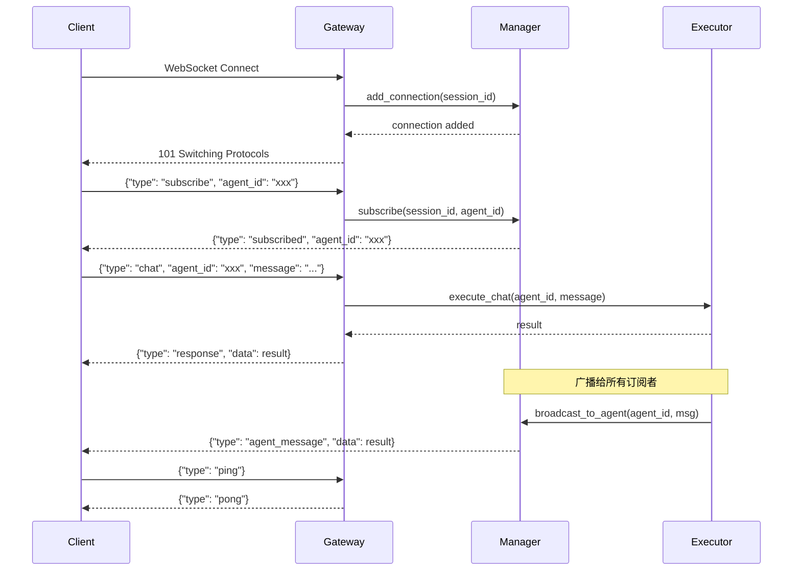
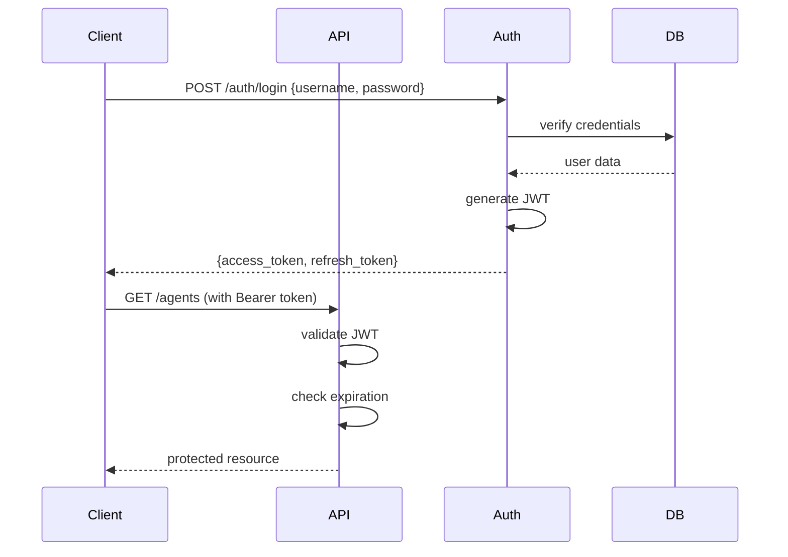

# API 接口设计

## REST API 设计

### 基础信息

| 项目 | 值 |
|------|-----|
| Base URL | `/api/v1` |
| Content-Type | `application/json` |
| 认证方式 | Bearer Token |

### 认证方案

```python
# Bearer Token 认证
Authorization: Bearer <jwt_token>

# Token 格式
{
    "sub": "user_id",
    "exp": 1234567890,
    "iat": 1234567890,
    "role": "admin|user|agent"
}
```

### Agent 管理 API

#### 创建 Agent

```
POST /api/v1/agents
```

**Request Body:**
```json
{
    "name": "写作助手",
    "role": "writer",
    "description": "专业文章写作助手",
    "instructions": "你是一位专业的写作助手...",
    "config": {
        "temperature": 0.7,
        "max_tokens": 2000,
        "tools": ["web_search", "calculator"]
    }
}
```

**Response:**
```json
{
    "id": "550e8400-e29b-41d4-a716-446655440000",
    "name": "写作助手",
    "role": "writer",
    "description": "专业文章写作助手",
    "instructions": "你是一位专业的写作助手...",
    "status": "idle",
    "config": {...},
    "created_at": "2024-01-15T10:30:00Z",
    "updated_at": "2024-01-15T10:30:00Z"
}
```

#### 列出所有 Agent

```
GET /api/v1/agents
```

**Response:**
```json
{
    "total": 2,
    "items": [
        {
            "id": "550e8400-e29b-41d4-a716-446655440000",
            "name": "写作助手",
            "role": "writer",
            "status": "idle"
        }
    ]
}
```

#### 获取 Agent 详情

```
GET /api/v1/agents/{agent_id}
```

#### 更新 Agent

```
PATCH /api/v1/agents/{agent_id}
```

**Request Body:**
```json
{
    "name": "新名称",
    "instructions": "新的指令...",
    "config": {
        "temperature": 0.8
    }
}
```

#### 删除 Agent

```
DELETE /api/v1/agents/{agent_id}
```

### Chat 对话 API

#### 发送消息

```
POST /api/v1/chat
```

**Request Body:**
```json
{
    "agent_id": "550e8400-e29b-41d4-a716-446655440000",
    "message": "帮我写一篇关于 AI 的文章",
    "session_id": "optional-session-id"
}
```

**Response:**
```json
{
    "task_id": "660e8400-e29b-41d4-a716-446655440001",
    "session_id": "session-123",
    "response": "好的，我来帮你撰写这篇关于 AI 的文章...",
    "agent_id": "550e8400-e29b-41d4-a716-446655440000"
}
```

#### 流式响应

```
POST /api/v1/chat/stream
```

**Request Body:**
```json
{
    "agent_id": "550e8400-e29b-41d4-a716-446655440000",
    "message": "帮我写一篇关于 AI 的文章",
    "session_id": "optional-session-id"
}
```

**Response (SSE):**
```
data: {"type": "start", "task_id": "..."}
data: {"type": "chunk", "content": "好的"}
data: {"type": "chunk", "content": "，我来"}
data: {"type": "chunk", "content": "帮你..."}
data: {"type": "done", "content": "完整响应"}
```

### 任务管理 API

#### 获取任务状态

```
GET /api/v1/tasks/{task_id}
```

**Response:**
```json
{
    "id": "660e8400-e29b-41d4-a716-446655440001",
    "agent_id": "550e8400-e29b-41d4-a716-446655440000",
    "session_id": "session-123",
    "status": "completed",
    "started_at": "2024-01-15T10:30:00Z",
    "completed_at": "2024-01-15T10:30:05Z"
}
```

#### 列出活跃任务

```
GET /api/v1/tasks
```

### 记忆管理 API

#### 获取 Agent 记忆

```
GET /api/v1/agents/{agent_id}/memory?limit=20
```

**Response:**
```json
{
    "short_term": [
        {
            "role": "user",
            "content": "帮我写一篇文章",
            "timestamp": "2024-01-15T10:30:00Z"
        },
        {
            "role": "assistant",
            "content": "好的，我来帮你...",
            "timestamp": "2024-01-15T10:30:01Z"
        }
    ],
    "long_term": [
        {
            "key": "user_preference",
            "value": {"style": "formal"},
            "created_at": "2024-01-10T08:00:00Z"
        }
    ]
}
```

#### 清空短期记忆

```
DELETE /api/v1/agents/{agent_id}/memory
```

### 工具管理 API

#### 列出可用工具

```
GET /api/v1/tools
```

**Response:**
```json
{
    "tools": [
        {
            "name": "web_search",
            "description": "搜索互联网获取最新信息",
            "enabled": true,
            "parameters": [
                {"name": "query", "type": "string", "required": true}
            ]
        }
    ]
}
```

#### 执行工具

```
POST /api/v1/tools/execute
```

**Request Body:**
```json
{
    "tool_name": "web_search",
    "parameters": {
        "query": "最新 AI 技术",
        "count": 5
    }
}
```

## WebSocket 实时通信设计

### 连接建立

```
ws://host:port/api/v1/ws?session_id=xxx
```

### 消息格式

```json
{
    "type": "message_type",
    "data": {},
    "timestamp": "2024-01-15T10:30:00Z"
}
```

### 消息类型

| 类型 | 方向 | 描述 |
|------|------|------|
| subscribe | Client → Server | 订阅 Agent 消息 |
| unsubscribe | Client → Server | 取消订阅 |
| chat | Client → Server | 发送聊天消息 |
| response | Server → Client | 响应消息 |
| agent_message | Server → Client | Agent 消息推送 |
| ping | Client → Server | 心跳检测 |
| pong | Server → Client | 心跳响应 |
| error | Server → Client | 错误消息 |

### 连接管理流程



### 心跳保活

```python
# 客户端应定期发送 ping
import asyncio

async def heartbeat(websocket):
    while True:
        await websocket.send_json({"type": "ping"})
        await asyncio.sleep(30)  # 每 30 秒一次
```

## API 认证方案

### JWT 认证流程



### Token 刷新机制

```
POST /api/v1/auth/refresh
```

**Request:**
```json
{
    "refresh_token": "xxx"
}
```

**Response:**
```json
{
    "access_token": "new_access_token",
    "expires_in": 3600
}
```

### 权限控制

```python
from enum import Enum

class Permission(str, Enum):
    AGENT_READ = "agent:read"
    AGENT_WRITE = "agent:write"
    AGENT_DELETE = "agent:delete"
    CHAT_ACCESS = "chat:access"
    TOOL_EXECUTE = "tool:execute"
    ADMIN = "admin"

# 角色权限映射
ROLE_PERMISSIONS = {
    "user": [Permission.AGENT_READ, Permission.CHAT_ACCESS],
    "agent": [Permission.AGENT_READ, Permission.CHAT_ACCESS, Permission.TOOL_EXECUTE],
    "admin": [p for p in Permission]
}
```

### 中间件实现

```python
from fastapi import Request, HTTPException
from fastapi.security import HTTPBearer, HTTPAuthorizationCredentials
import jwt

security = HTTPBearer()

async def verify_token(credentials: HTTPAuthorizationCredentials = Depends(security)):
    token = credentials.credentials
    try:
        payload = jwt.decode(token, SECRET_KEY, algorithms=["HS256"])
        return payload
    except jwt.ExpiredSignatureError:
        raise HTTPException(status_code=401, detail="Token expired")
    except jwt.InvalidTokenError:
        raise HTTPException(status_code=401, detail="Invalid token")

async def check_permission(request: Request, token: dict = Depends(verify_token)):
    path = request.url.path
    method = request.method
    
    # 检查权限
    required_permission = get_required_permission(path, method)
    user_permissions = ROLE_PERMISSIONS.get(token.get("role", ""), [])
    
    if required_permission not in user_permissions and Permission.ADMIN not in user_permissions:
        raise HTTPException(status_code=403, detail="Permission denied")
```

## 错误响应格式

```json
{
    "error": {
        "code": "AGENT_NOT_FOUND",
        "message": "Agent with id 'xxx' not found",
        "details": {},
        "request_id": "req-123"
    }
}
```

### 错误码定义

| 错误码 | HTTP 状态 | 描述 |
|--------|-----------|------|
| VALIDATION_ERROR | 400 | 请求参数验证失败 |
| UNAUTHORIZED | 401 | 未认证 |
| FORBIDDEN | 403 | 无权限 |
| NOT_FOUND | 404 | 资源不存在 |
| RATE_LIMITED | 429 | 请求过于频繁 |
| INTERNAL_ERROR | 500 | 服务器内部错误 |
| AGENT_NOT_FOUND | 404 | Agent 不存在 |
| AGENT_ERROR | 500 | Agent 执行错误 |
| TOOL_NOT_FOUND | 404 | 工具不存在 |
| TOOL_DISABLED | 403 | 工具已禁用 |

## 请求限流

```python
from fastapi import Request
from slowapi import Limiter
from slowapi.util import get_remote_address

limiter = Limiter(key_func=get_remote_address)

@app.post("/api/v1/chat")
@limiter.limit("10/minute")
async def chat(request: Request, ...):
    ...
```

## OpenAPI Schema

```yaml
openapi: 3.0.0
info:
  title: AI Agent Platform API
  version: 1.0.0
  description: 企业级多 Agent 协作平台 API

servers:
  - url: /api/v1
    description: API v1

paths:
  /agents:
    get:
      summary: 列出所有 Agent
      tags: [Agent]
      responses:
        '200':
          description: 成功
          content:
            application/json:
              schema:
                type: object
                properties:
                  items:
                    type: array
                    items:
                      $ref: '#/components/schemas/Agent'
    post:
      summary: 创建 Agent
      tags: [Agent]
      requestBody:
        required: true
        content:
          application/json:
            schema:
              $ref: '#/components/schemas/AgentCreate'
      responses:
        '201':
          description: 创建成功

components:
  schemas:
    Agent:
      type: object
      properties:
        id:
          type: string
          format: uuid
        name:
          type: string
        role:
          type: string
        status:
          type: string
          enum: [idle, running, error]
    AgentCreate:
      type: object
      required: [name, role, instructions]
      properties:
        name:
          type: string
        role:
          type: string
        instructions:
          type: string
        config:
          type: object
```
